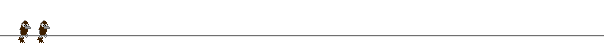

<p align="center">
  
</p>

<h1 align="center">Ocean View <br/>Resort Booking and Management System</h1>
<div align="center" style="width:100%;">
  
</div>
## 📖 About Ocean View RBMS

The Ocean View is an innovative web-based platform designed to revolutionize the beach reservation experience for a resort that currently uses manual processes for managing bookings and resources. The system aims to continue the process of booking beach spots, amenities, and activities for tourists while helping beach management maintain organization and optimize their resources. OceanView will provide a user-friendly interface for users to explore resorts, view availability, make reservations, and manage their bookings effortlessly.

## ✨ Key Features

🔐 User Authentication & Authorization
Secure login system for users and administrators.

Role-Based Access Control (RBAC):
1. Super Admin
- Has full access to the system.
- Can manage all resorts, resort admins, users, reports, and system-wide settings.
- Can create and assign roles.
- Can deactivate or delete any account, including resort admins.
2. Resort Admin
- Manages a specific resort.
- Can add, edit, and delete rooms within their assigned resort.
- Can manage bookings, guests, and reports for their resort.
- Cannot manage other resort admins or system-wide settings.
3. Staff (Optional - If Needed)
- Can assist in managing bookings and guests.
- Can generate reports but cannot edit resort settings.
4. Guest/User
- Can book rooms and make payments.
- Can view their own booking history.
- Can update their profile but has no administrative privileges.

💰 Online Beach Resort Reservation System
Core Features:
1. Guest Features:
- ✅ Room Browsing & Booking – Guests can view available rooms, resort amenities, and book online.
- ✅ Real-Time Availability Check – Prevents double booking by updating availability in real-time.
- ✅ User Dashboard – Guests can manage reservations, payments, and personal details.
- ✅ Online Payments & Invoicing (Optional) – Secure payment gateways (e.g., PayPal, Stripe) with automatic invoice generation.
- ✅ Cancellation & Refund Policy – Guests can cancel bookings (within policy limits) and get automated refunds if applicable.

2. Resort Admin Features:
- ✅ Room & Pricing Management – Add/edit room details, pricing, discounts, and seasonal rates.
- ✅ Booking & Payment Management – View, confirm, or cancel reservations and process payments.
- ✅ Guest Management – Track guest profiles, preferences, and booking history.
- ✅ Reports & Analytics – Generate financial reports, occupancy trends, and revenue insights.

3. Super Admin Features:
- ✅ System-Wide Management – Oversee all resorts, admins, and users.
- ✅ User & Role Management – Create roles (Admin, Staff, Guest) and assign permissions.
- ✅ Audit Logs – Track system activities, bookings, and transactions.
- ✅ Security & Compliance – Manage system security settings, enforce authentication, and prevent unauthorized access.

🔹 Additional Enhancements:
- ✅ 🔄 Automated Email & SMS Notifications – Booking confirmations, reminders, and promotions.
- ✅ ⭐ Customer Reviews & Ratings – Guests can rate and review resorts after their stay.
- ✅ 📅 Event & Package Booking – Offer packages like honeymoon deals, water sports, or group discounts.
- ✅ 🔑 Digital Check-In & Check-Out – QR-based check-in to minimize wait times.
- ✅ 🎭 Multi-Language & Multi-Currency Support – For international guests.
- ✅ 🎟️ Promo Codes & Discounts – Admins can create promotional offers.
- ✅ 🛡️ Two-Factor Authentication (2FA) – For secure account logins.

📊 Reporting System

1️⃣ Reservation Reports
- ✔ Total Bookings – Daily, weekly, monthly, and yearly booking summaries.
- ✔ Room Occupancy Rate – Percentage of booked rooms vs. available rooms over time.
- ✔ Peak & Off-Peak Analysis – Identify high-demand periods for better pricing strategies.
- ✔ Cancelled & No-Show Bookings – Track lost revenue and identify trends.

2️⃣ Revenue Reports
- ✔ Total Revenue Breakdown – Income from bookings, add-ons, and extra services.
- ✔ Payment Methods Summary – Track transactions via card, cash, PayPal, Stripe, etc.
- ✔ Pending & Completed Payments – Monitor unpaid reservations and successful transactions.
- ✔ Refund Reports – Record all refunds and reasons for cancellations.

3️⃣ Guest Reports
- ✔ Frequent Guests & VIPs – Identify loyal customers for rewards programs.
- ✔ Guest Demographics – Analyze location, age, and booking behavior.
- ✔ Average Stay Duration – Determine trends in short-term vs. long-term stays.

4️⃣ Resort Performance Reports
- ✔ Most & Least Booked Rooms – Helps in optimizing pricing & promotions.
- ✔ Seasonal Trends – Understand booking fluctuations throughout the year.
- ✔ Staff Performance (Optional) – Track check-in/out handling time and issue resolutions.

5️⃣ System Audit & Security Reports
- ✔ Login & Access Logs – Monitor admin and staff activity.
- ✔ Failed Payment Attempts – Detect potential fraud or payment issues.
- ✔ Data Export (CSV, PDF, Excel) – Allow admins to download reports for offline use.

## 🛠️ Tech Stack

## Frontend
- React.js – Core frontend framework
- React Router – For navigation and routing
- Tailwind CSS / Material-UI – For styling and UI components
- Recharts or Chart.js – For reports and data visualization

## Backend
- Raw PHP (for course requirement)

## Database

- MySQL: A reliable relational database for storing and managing data.

## 🚀 Getting Started

Prerequisites:

- ✔ PHP 8.0 or higher – Ensures compatibility with modern features
- ✔ Composer – For managing PHP dependencies (e.g., PHPMailer, JWT, Laravel, etc.)
- ✔ MySQL (or PostgreSQL) – Database for storing booking, user, and payment data
- ✔ Apache/Nginx – Web server to run PHP applications
- ✔ Node.js & npm – Required for React dependencies

## Installation

1. Clone the repository:

```bash
  git clone https://github.com/a3jraparece/IT223_resort_booking_and_management_system.git
  cd IT223_resort_booking_and_management_system
```

2. Install dependencies:

```bash
  npm install
```

3. run the application:

```bash
  npm run dev
```

6. Access the application:

```bash
   Open your browser and navigate to http://localhost:5173/?
```
## 📊 Project Analytics


## 🙏 Acknowledgments

Developed by:
- Patrica ? Cabelin
- Jelou E. Capumpue
- Alex, Jr. A. Aparece
- Aldren Ross M. Luga
- Micah Angela E. Floro

  

